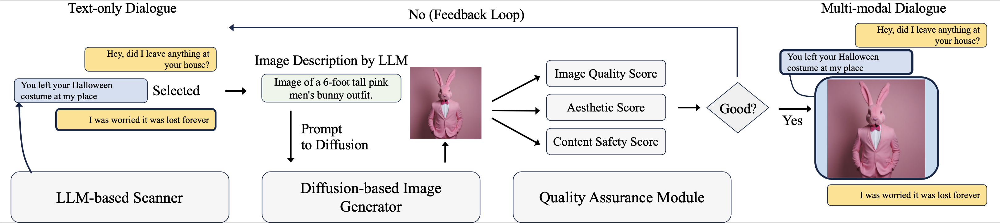

<p align="center">

</p>

# MAGID: An Automated Pipeline for Generating Synthetic Multi-modal Datasets

Authors: Hossein Aboutalebi, Hwanjun Song, Yusheng Xie, Arshit Gupta, Justin Sun, Hang Su, Igor Shalyminov, Nikolaos Pappas, Siffi Singh, Saab Mansour

Development of multimodal interactive systems is hindered by the lack of rich, multimodal (text, images) conversational data, which is needed in large quantities for LLMs. Previous approaches augment textual dialogues with retrieved images, posing privacy, diversity, and quality constraints. In this work, we introduce Multimodal Augmented Generative Images Dialogues (MAGID), a framework to augment text-only dialogues with diverse and high-quality images. Subsequently, a diffusion model is applied to craft corresponding images, ensuring alignment with the identified text. Finally, MAGID incorporates an innovative feedback loop between an image description generation module (textual LLM) and image quality modules (addressing aesthetics, image-text matching, and safety), that work in tandem to generate high-quality and multi-modal dialogues. We compare MAGID to other SOTA baselines on three dialogue datasets, using automated and human evaluation. Our results show that MAGID is comparable to or better than baselines, with significant improvements in human evaluation, especially against retrieval baselines where the image database is small.

**Update: Our work has been accepted to NAACL 2024!**
Please check out our work [here](https://arxiv.org/abs/2403.03194)

<p align="center">

</p>

## Documentation

This repo contains both the dataset and the code for the paper "MAGID: An Automated Pipeline for Generating Synthetic Multi-modal Datasets". Please check the documentation for the dataset [here](dataset/README.md)

## Code Structure

The code can run by calling `python main.py` in `src/main.py` file with the following arguments:

```
"--config_data_yaml": The path to the yaml file containing the path of image/data of the input dataset,
"--credentials": The path to the credentials file for the GPT-3 API,
"--cuda_n": The GPU number to use,
"--diffusion_model": Type of diffusion model to use. Default: stabilityai/stable-diffusion-xl-base-1.0,
"--llm_model": Type of diffusion model to use. Default: gpt-3.5-turbo,
"--min_score_aesthetic": Minimum Aesthetic score in QA module of MAGID. Default: 0.51,
"--name_second_dataset": Name of the input dataset. Default: PhotoChat,
"--output_path": output path to save the generated dataset. 
"--prompt_type": type of prompt to be used. Default: COT_V5,
"--seed": seed of the experiment. Default: 8,
"--size_experiment": Number of input dataset samples to transform with MAGID. Default: 10,
"--thresholds": thresholds for CLIP. Default: 0.51
```

The code will generate a synthetic dataset in the output path specified. It also create a folder called with number set in `--thresholds` where it  contains the visualization of each sample transformed with MAGID.
It also saves the generated prompts in the output path in the file named `magi_prompt.pkl`.
It saves the images in the file named 'images' in the output.

The dataset generated by MAGID itself is saved in the output path in the file named `magi_dataset.json`.


## Citation

If you found the framework useful, please consider citing our work.

```{bibtex}
@article{aboutalebi2024magid,
  title={MAGID: An Automated Pipeline for Generating Synthetic Multi-modal Datasets},
  author={Aboutalebi, Hossein and Song, Hwanjun and Xie, Yusheng and Gupta, Arshit and Sun, Justin and Su, Hang and Shalyminov, Igor and Pappas, Nikolaos and Singh, Siffi and Mansour, Saab},
  journal={arXiv preprint arXiv:2403.03194},
  year={2024}
}
```
