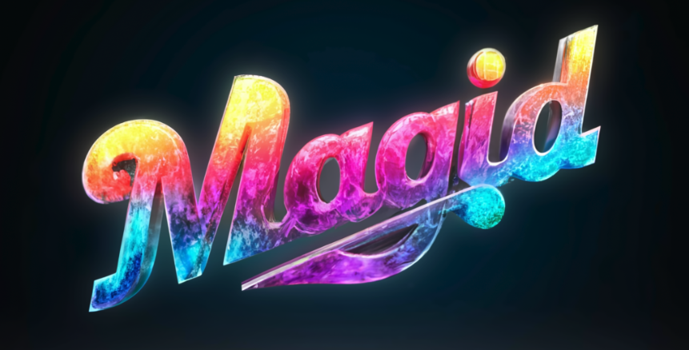
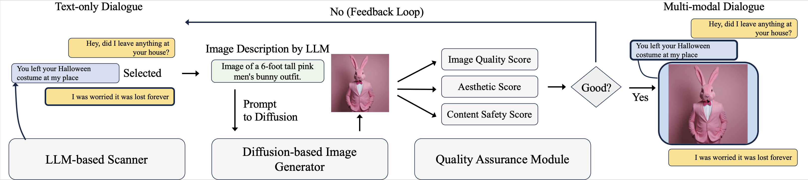

<p align="center">

</p>

# MAGID: An Automated Pipeline for Generating Synthetic Multi-modal Datasets

Authors: Hossein Aboutalebi, Hwanjun Song, Yusheng Xie, Arshit Gupta, Justin Sun, Hang Su, Igor Shalyminov, Nikolaos Pappas, Siffi Singh, Saab Mansour

Development of multimodal interactive systems is hindered by the lack of rich, multimodal (text, images) conversational data, which is needed in large quantities for LLMs. Previous approaches augment textual dialogues with retrieved images, posing privacy, diversity, and quality constraints. In this work, we introduce Multimodal Augmented Generative Images Dialogues (MAGID), a framework to augment text-only dialogues with diverse and high-quality images. Subsequently, a diffusion model is applied to craft corresponding images, ensuring alignment with the identified text. Finally, MAGID incorporates an innovative feedback loop between an image description generation module (textual LLM) and image quality modules (addressing aesthetics, image-text matching, and safety), that work in tandem to generate high-quality and multi-modal dialogues. We compare MAGID to other SOTA baselines on three dialogue datasets, using automated and human evaluation. Our results show that MAGID is comparable to or better than baselines, with significant improvements in human evaluation, especially against retrieval baselines where the image database is small.

**Update: Our work has been accepted to NAACL 2024!**
Please check out our work [here](https://arxiv.org/abs/2403.03194)

<p align="center">

</p>

## Documentation

This repo contains the dataset for the paper "MAGID: An Automated Pipeline for Generating Synthetic Multi-modal Datasets". Please check the documentation for the code [here](../README.md)

## Dataset Structure

The dataset is generated using the MAGID pipeline.
The dataset consists of two folders `train` and `test`. Each folder contains `data.json`:
The json file contains the following fields:
- dialogue_id: Unique identifier for the dialogue
- dialogue: List of dialogue turns
- utterance: 
    - Each utterance in the dialogie is a list. 
    - If it is Textual utterance, the first element of the list is "txt" and the next element is the utterance iteself. 
    - If it is Image Utterance, the first element is "img" and the next element is the image path and the last utterance is image caption. Due to legal restrictions, we are not able to provide the images. However, the images can be regenerated using the image caption and open-source image generation models. The image utterance is supporting the previous text utterance.
    - The dialogue turns changes when the new text utterance appears.

Example: 

```json
{
    "1860": [
        [
            "txt",
            "hi how are you today"
        ],
        [
            "txt",
            "great ! you ? i am kevin . "
        ],
        [
            "txt",
            "Nice to meet you Kevin. I am doing well. Check my swimming picture. It is so cool"
        ],
        [
            "img",
            "image_Image_of_someone_sw.png",
            " Image of someone swimming in a pool. "
        ]
}
```

Here `1860` is the dialogue id and the dialogue consists of 3 turns. The first three turn is a text utterance, and the last turn is an image utterance. The image utterance is supporting the previous text utterance.

## Citation

If you found the framework useful, please consider citing our work.

```{bibtex}
@article{aboutalebi2024magid,
  title={MAGID: An Automated Pipeline for Generating Synthetic Multi-modal Datasets},
  author={Aboutalebi, Hossein and Song, Hwanjun and Xie, Yusheng and Gupta, Arshit and Sun, Justin and Su, Hang and Shalyminov, Igor and Pappas, Nikolaos and Singh, Siffi and Mansour, Saab},
  journal={arXiv preprint arXiv:2403.03194},
  year={2024}
}
```
